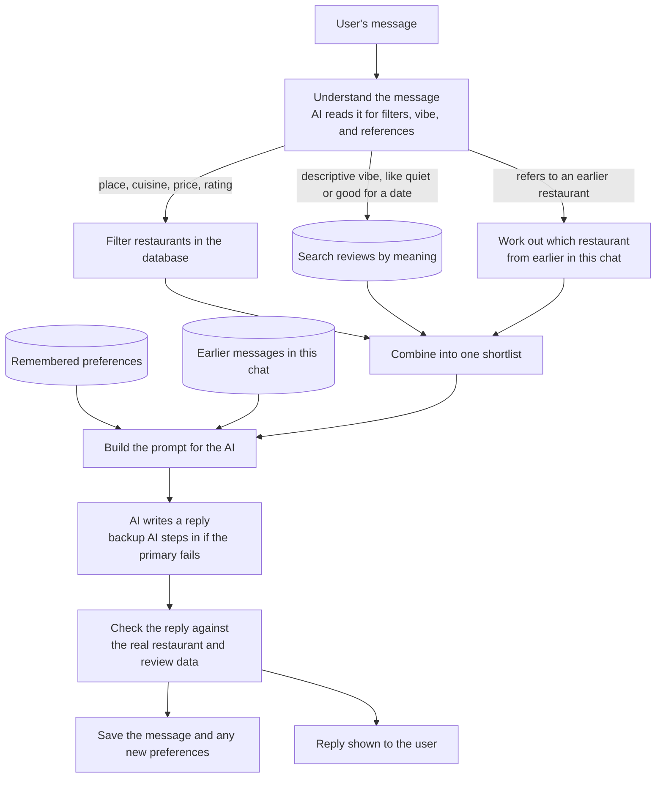

# Architecture: AI Restaurant Chat Assistant

## 1. Overview

A chat assistant that helps users find restaurants: users converse naturally
("suggest a quiet vegetarian place under ₹1000"), and the assistant grounds
its answers in both structured restaurant facts and real customer review
text, remembering stated preferences (e.g. "I'm vegetarian") across
conversations.

**Data source:** [ManikaSaini/zomato-restaurant-recommendation](https://huggingface.co/datasets/ManikaSaini/zomato-restaurant-recommendation) (Hugging Face), with about 9,200 restaurants and 226k customer reviews.

**Core design principle: hybrid retrieve-then-generate (RAG-style).**
The LLM is never given the raw dataset or asked to "know" restaurants from
memory. Structured facts (place, cuisine, price, rating) stay structured,
using exact and cheap SQL filtering. Only the qualitative part of a query
("quiet", "good for a date") goes through embeddings: pgvector semantic
search over review text, restricted to the structured candidate pool when
both are present, so "quiet date spot in Koramangala under ₹800" never
returns a quiet place outside Koramangala just because its reviews scored
well semantically. The LLM only ranks, explains, and phrases the reply from
that grounded shortlist plus real review excerpts. It is never allowed to
invent a restaurant or a claim that isn't backed by the data it was given.



---

## 2. Backend package layout

The backend is an installable Python package (`backend/pyproject.toml`,
`pip install -e .`) organized by domain under `app/`, with no `sys.path`
manipulation anywhere; every cross-module import is a normal
`from app.<domain>.<module> import ...`.

```
backend/
  app/                     installable package
    settings.py            loads backend/.env once, on first import of `app`
    logging_config.py      configures the "app" logger tree -> console + backend/dump.log
    data/                  acquisition.py, cleaning.py (one-off dataset prep scripts)
    storage/               db.py (pooled connection), schema.py, load.py
    auth/                  tokens.py (JWT/bcrypt), users.py, password_reset.py, email.py, schema.py
    llm/                   groq_client.py (primary), gemini_client.py (fallback), untrusted.py
    reviews/                schema.py, ingest.py, embed.py, embedding_model.py
    conversation/           store.py (conversations/messages), preferences.py (durable facts), schema.py
    retrieval/               known_values.py, hybrid.py, fusion.py, relaxation.py, cache.py
    query_understanding/     understanding.py
    chat/                     prompt_builder.py, response_formatter.py, service.py
    api/                      main.py (FastAPI app + routes)
  data/                    raw/processed datasets (gitignored CSVs; not shipped in the package)
  evaluation/              scenario-based grounding/relevance evaluation (see EVALUATION.md)
```

Each domain package carries its own colocated `tests/`. Database schemas
(`schema.sql`) live next to the module that owns that table.

---

## 3. Components

| Component | Package | Responsibility |
|---|---|---|
| Data prep | `app/data` | One-off scripts: fetch the raw HF dataset, clean/normalize/dedup it into `restaurants_clean.csv` |
| Storage | `app/storage` | PostgreSQL connection pool (`ThreadedConnectionPool`) + `restaurants` schema/load |
| Auth | `app/auth` | Registration/login, bcrypt password hashing, JWT issue/verify, password reset tokens, transactional email (Resend) |
| LLM | `app/llm` | Groq client (primary) with automatic Gemini fallback on error; shared by query understanding and chat generation. Also owns fencing/length-capping of untrusted text bound for a prompt |
| Review Ingestion | `app/reviews` | Re-derives individual reviews from the raw dataset, embeds them locally (`sentence-transformers`, 384-dim), stores in pgvector |
| Conversation Store | `app/conversation` | `conversations`/`messages` (multi-turn memory) and `user_preferences` (durable, cross-session soft-default facts) |
| Retrieval | `app/retrieval` | Known place/cuisine values (cached in-process, for snapping free text to canonical DB casing); hybrid structured-SQL + pgvector semantic retrieval, rank fusion of the two orderings, a bounded constraint-relaxation ladder, and an in-process TTL cache in front of it |
| Query Understanding | `app/query_understanding` | One LLM JSON-mode call per message: intent, hard filters, vibe query, reference resolution, durable preference extraction |
| Chat | `app/chat` | Multi-turn prompt construction, review-grounded response formatting, and the service layer orchestrating one full chat turn |
| API | `app/api` | FastAPI app: auth routes + chat routes (including SSE token streaming), behind a JWT dependency. Owns request-id tagging, the DB-backed health check, and the threadpool/pool concurrency cap |
| Evaluation | `evaluation/` | Scenario-based grounding/relevance checks against the live retrieval + generation pipeline |
| Frontend | `frontend/` | React app. Chat is the sole post-login screen, plus login, register, forgot-password, and reset-password flows |

---

## 4. Key design decisions

- **Hybrid retrieval, not pure RAG-over-everything.** Structured constraints
  (place/cuisine/price/rating) are always exact SQL; only the qualitative
  remainder of a query goes through embeddings, and semantic search is
  restricted to the structured candidate pool when both are present. Cheaper
  and keeps hard constraints exact, at the cost of needing a query
  understanding step to separate the two.
- **The two halves are fused by rank, not collapsed into one.**
  (`app/retrieval/fusion.py`) A restaurant's semantic score is the sum of its
  top-3 review similarities, so sustained evidence beats a single lucky
  review, and volume alone can't win. That ordering is then merged with the
  structured one (rating/votes) via Reciprocal Rank Fusion. RRF rather than a
  weighted sum because cosine similarities and star ratings live on
  incompatible scales, and any weighting of the raw numbers needs arbitrary
  constants that drift with the dataset. Ranking previously used only each
  restaurant's single best review and discarded the structured signal
  entirely whenever a vibe query was present.
- **Soft constraints are widened a step at a time, and the reply says so.**
  (`app/retrieval/relaxation.py`) When strict filters match nothing, budget
  and rating are loosened along a bounded ladder - one dimension at a time,
  by a bounded amount - and the specific change is passed to the prompt as a
  sentence ("nothing under Rs 500, these are up to Rs 750"). Place and cuisine
  are never relaxed: a Thai place in Whitefield is not a partial answer to
  "Chinese in Indiranagar". The ladder is probed at its loosest rung first, so
  a query that place/cuisine alone rule out costs one round trip rather than
  walking every rung.
- **Query understanding is a separate LLM call from generation.** One call
  extracts structure from *one message*; a second call writes a grounded
  reply from a *candidate shortlist*. Mixing them would mean re-parsing the
  model's own prose to figure out what it was asked, exactly the kind of
  hallucination surface the rest of the pipeline avoids.
- **JWT bearer auth, not server-side sessions.** The React SPA and FastAPI
  backend are separate processes talking over CORS; a signed, stateless
  token avoids needing shared session storage (Redis) at this scale. Token
  is persisted client-side in `localStorage`: simple and sufficient here,
  but readable by JS (an XSS risk); an httpOnly cookie would be more
  defensive if hardened for production traffic.
- **Preferences are soft defaults, not hard filters.** A stored fact like
  "vegetarian" is folded into the semantic (vibe) side of retrieval and
  shown to the LLM as a bias, not enforced as a SQL `WHERE` clause, so a
  one-off request in the current message can still override it. A known
  limit of that choice: a soft bias is the wrong instrument for a dietary
  restriction that is actually non-negotiable, since "vegetarian" in the
  embedding text finds restaurants whose *reviews mention* vegetarian food.
- **Preference keys are a closed vocabulary; values stay free text.**
  (`app/conversation/preferences.py`) Query understanding chooses the key
  itself, so the key is validated and canonicalized at both the model
  boundary and the storage boundary. When it wasn't, a model answering
  `diet` instead of `dietary` produced a fact that was stored, shown to the
  user in the preferences panel, and then silently never applied to any
  search. Values can't be enumerated up front and are left alone.
- **Filter carry-over between turns is implicit, and that's a trade-off.**
  Nothing persists "under Rs 800" - `HybridFilters` is rebuilt from scratch
  each turn, and a budget survives only because query understanding re-reads
  it out of the last 10 messages. That's why follow-ups like "something
  cheaper?" work with no special-casing, and equally why a constraint can
  silently persist (or silently stop applying) with nothing in the UI showing
  which are in force. An explicit per-conversation filter state with visible,
  removable chips is the deliberate next step, not an oversight.
- **Groq primary, Gemini fallback.** If Groq errors (rate limit, outage,
  bad key), both the chat-generation call and the query-understanding call
  automatically retry against Gemini rather than failing the request
  outright.
- **A real installable package, not `sys.path.insert()`.** Every
  cross-module import is a normal package import. This isn't just cosmetic:
  a `sys.path`-hacked layout previously let the same retrieval/relax-on-empty
  logic get duplicated across two unrelated modules unnoticed, and separately
  contributed to a real connection-pool deadlock bug (a re-entrant `close()`
  call recursing into a non-reentrant lock) that only became avoidable once
  the codebase had one clear ownership structure per concern.
- **Real logging, not silent by default.** Every domain module logs via
  `logging.getLogger(__name__)`, configured once (`app/logging_config.py`).
  This covers auth attempts and outcomes, retrieval candidate counts and
  relaxation/fallback triggers, which LLM provider served a reply, and
  persisted chat turns, all traceable after the fact without attaching a
  debugger. Logs go to **stdout** by default, with a rotating file only when
  `LOG_FILE` is set: writing to local disk by default meant that on a
  platform with an ephemeral filesystem the logs vanished on every restart,
  i.e. exactly where a debugger can't be attached. Each request is tagged
  with an id (`X-Request-ID` honoured if a proxy set one), carried in a
  ContextVar, so one chat turn can be followed across modules in an
  interleaved stream.
- **Concurrency is bounded in one place.** All routes are sync, so FastAPI
  runs them on AnyIO's worker threadpool - 40 threads by default, against a
  connection pool that was 10. Past 10 concurrent requests the 11th didn't
  queue, it raised `PoolError`. The threadpool is now capped at the pool size
  at startup (`DB_MAX_CONNECTIONS`), making the pool the single concurrency
  limit; no request path holds two pooled connections at once, which is what
  makes matching them exactly safe.
- **Untrusted text is fenced before it reaches a prompt.**
  (`app/llm/untrusted.py`) Both the user's message and the review text quoted
  out of the dataset are third-party content interpolated next to our own
  instructions - direct and *indirect* prompt injection respectively. Both are
  length-capped and wrapped in delimiters that are stripped from the content
  first (a fence the author can reproduce isn't a fence), with a matching
  instruction in each system prompt. The blast radius is small by
  construction - no tools, no writes, no secrets in context - so the
  mitigation is deliberately proportionate, and the post-generation grounding
  check remains what actually constrains what a user can be shown.

## 5. Open decisions / explicitly out of scope

- **Refresh-token rotation, email verification, rate-limiting on login,
  role-based admin access, JWT in an httpOnly cookie rather than
  `localStorage`.** None of these are required by the current feature set;
  noted here so they're a deliberate omission, not an oversight. The cookie
  migration in particular is a cross-cutting auth change (CSRF handling, CORS
  credentials, a logout endpoint), not a patch.
- **Schema migrations.** Schema changes are applied as idempotent
  `create table if not exists` / `alter table ... add column if not exists`
  statements in each domain's `schema.sql`. That has no version history and
  no rollback; Alembic is the answer once the schema changes more often than
  it does now.
- **A shared cache.** The retrieval TTL cache is per-process, so it's cold
  after every restart and isn't shared between instances. Fine at one
  instance; Redis is the move at more than one.
- **Rate limiting on the chat endpoint.** Each turn costs two LLM calls, and
  nothing currently bounds how fast a logged-in user can spend them.
- **Deployment and monitoring.** No packaging/deploy pipeline or production
  logging/metrics infrastructure exists yet beyond the local `dump.log`;
  not yet needed at this project's stage.
- **Statistical/large-scale LLM evaluation** (hundreds of scenarios, scored
  rubrics) is not warranted at this project's scale; see
  `evaluation/EVALUATION.md` for what's covered instead.
