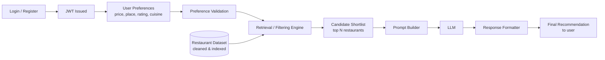

# Architecture — AI Restaurant Recommendation Service

## 1. Overview

A service that takes structured user preferences (**price, place, rating, cuisine**), retrieves matching candidates from a restaurant dataset, and uses an **LLM** to turn them into a clear, natural-language recommendation — behind a login, through a polished, production-ready interface.

**Data source:** [ManikaSaini/zomato-restaurant-recommendation](https://huggingface.co/datasets/ManikaSaini/zomato-restaurant-recommendation) (Hugging Face)

**Core design principle — retrieve-then-generate (RAG-style):**
The LLM is never given the raw dataset or asked to "know" restaurants from memory. A filtering/retrieval step narrows the dataset down to a small, relevant candidate set first; the LLM only ranks, explains, and phrases the recommendation from that grounded shortlist. This avoids hallucinated restaurants and keeps LLM cost/latency low.

---

## 2. Phases

### Phase 1 — Data Acquisition
- Pull the dataset from Hugging Face (`ManikaSaini/zomato-restaurant-recommendation`) via the `datasets` library or the HF Hub API.
- Persist a raw, untouched local/cloud copy (source of truth for reprocessing).
- Capture dataset schema, size, and field meanings (what "place", "price", "rating", "cuisine" actually look like in the raw data).

### Phase 2 — Data Cleaning & Normalization
- Handle missing/null values (e.g., missing rating or cuisine).
- Normalize categorical fields:
  - **Cuisine** → consistent taxonomy (split multi-cuisine strings, standardize casing/spelling).
  - **Place/Location** → standardized city/area names.
  - **Price** → consistent numeric range or bucketed tiers (e.g., ₹, ₹₹, ₹₹₹).
  - **Rating** → consistent numeric scale.
- Deduplicate entries.
- Output a clean, processed dataset ready for querying.

### Phase 3 — Storage & Indexing
- Load the cleaned data into **PostgreSQL** for structured filtering (preferences are all structured attributes — no vector search required for this stage).
- Add indexes on `cuisine`, `place`, `price`, `rating` to make filtering fast.
- (Optional/future) Add embeddings if free-text preferences (e.g., "romantic place for a date") are supported later.

### Phase 4 — Preference Input Layer
- Define the accepted input schema: price range/tier, place, minimum rating, cuisine(s).
- Validate and normalize incoming user input against the same taxonomy used in Phase 2 (so filters actually match stored values).

### Phase 5 — Retrieval / Filtering Engine
- Query the store using the validated preferences.
- Rank/filter down to a small candidate shortlist (e.g., top 5–10) using deterministic rules (rating desc, price fit, cuisine/place match).
- This shortlist is the *only* restaurant data the LLM will ever see.

### Phase 6 — Prompt Construction
- Build a structured prompt containing:
  - The user's original preferences.
  - The candidate shortlist (name, cuisine, price, rating, place — factual fields only).
  - Instructions constraining the LLM to recommend **only** from the given shortlist and to explain its choice.

### Phase 7 — LLM Recommendation Engine
- Send the prompt to **Groq** (chat completion).
- LLM selects/ranks from the shortlist and produces a natural-language explanation (why this restaurant fits the stated preferences).

### Phase 8 — Response Formatting & Output
- Parse the LLM's output into a consistent response shape: recommended restaurant(s) + reasoning + key facts (cuisine/price/rating/place).
- Ensure the final output reads as one clear, user-friendly recommendation (not a raw dump).

### Phase 9 — Authentication & Authorization

**Where this fits and why:** Phases 4–8 are pure, user-agnostic backend logic — filtering restaurants, building prompts, calling the LLM, formatting output. None of it needs to know *who* is asking, so it stays simple and independently testable. Authentication only becomes meaningful once that logic is exposed to real people over a network — which is exactly what Phase 10 (Interface Layer) does next. Placing Auth here, right before the API is wired up for real use, means:
- Phases 4–8 never had to thread a `user_id` through logic that doesn't need it.
- The new `users` table extends the existing PostgreSQL storage (Phase 3) without touching the `restaurants` schema.
- The Interface Layer (Phase 10) can consume a ready-made "require login" dependency instead of retrofitting one later.
- The frontend (Phase 11) builds its login/register screens against auth endpoints that already work.

**What this phase includes:**
- **User registration** — `POST /auth/register`: email + password (+ display name), stored in a new `users` table.
- **Password hashing** — passwords are never stored in plaintext; hashed with **bcrypt** (adaptive cost, industry standard) before touching the database.
- **Login** — `POST /auth/login`: verifies email/password against the stored hash, issues a signed **JWT** access token on success.
- **JWT-based authentication** (over server-side sessions) — chosen because the frontend (React SPA) and backend (FastAPI) are already separate processes talking over CORS-configured HTTP. A stateless bearer token avoids needing shared session storage (e.g., Redis), which isn't warranted at this project's scale. The token is signed with a secret key (env var), carries the user id and an expiry, and is sent as `Authorization: Bearer <token>` on every subsequent request.
- **Protected API routes** — a reusable FastAPI dependency decodes and validates the JWT on incoming requests; applied to `/recommend` so only logged-in users can get recommendations.
- **Authorization** — beyond "is this token valid," routes touching user-specific data (e.g., the profile endpoint) check that the token's user id matches the resource being accessed (ownership-based authorization), not just that *some* valid user is logged in.
- **User management** — `GET /auth/me` (view own profile). Logout is handled client-side (discard the token), since JWTs are stateless.

**How it interacts with each layer:**
- **PostgreSQL:** a new `users` table (id, email unique, hashed_password, display name, created_at), added with the same indexing/constraint conventions established in Phase 3.
- **FastAPI:** new `/auth/register`, `/auth/login`, `/auth/me` routes, plus a `get_current_user` dependency (decodes the `Authorization` header, loads the user, raises 401 if invalid/expired/missing) applied to `/recommend` and future protected routes.
- **React:** a login/register form, an auth context/provider holding the current user + token (persisted to `localStorage` so a page refresh doesn't log the user out), an `Authorization` header attached to every API call once logged in, and route guarding that redirects unauthenticated users to the login screen before they can reach the preference form.

### Phase 10 — Application / Interface Layer
- **Backend API** (FastAPI): exposes `/auth/*` (Phase 9) and `/recommend` (now behind the login-required dependency), plus `/options` for populating the frontend's dropdowns.
- **Web UI**: the React app calling these endpoints — its design process is its own dedicated phase next, not treated as an afterthought.

### Phase 11 — UI/UX Design & Frontend Development

This is not "build a React page" — it's a deliberate design process before and during implementation, covering the full experience rather than a single form:
- **User flows** — map the actual screens and transitions: Landing → Register/Login → Preference Form → Loading → Results (or Empty/Error) → Profile/Logout. Every transition has an obvious next action.
- **Wireframing** — low-fidelity layout sketches for each screen (content hierarchy, placement of key actions) decided *before* writing component code.
- **Component design** — a small reusable component set (Button, Input/Select, Card, Navbar, Spinner, Alert/Toast, Modal) built on shared design tokens (color palette, spacing scale, typography scale) instead of one-off inline styles per screen.
- **Responsive layouts** — mobile/tablet/desktop breakpoints; the results grid and navigation adapt rather than just shrinking.
- **Loading states** — visible feedback while waiting on calls that aren't instant (the LLM call especially can take a few seconds) — skeletons/spinners, not a frozen-looking button.
- **Empty states** — a clear, friendly screen before any search has been made, distinct from the "search found nothing" state.
- **Error states** — one consistent visual pattern (banner/toast) for validation errors, unknown place/cuisine, network failures, and auth failures (expired/missing token → prompted to log in again).
- **Navigation** — a persistent header with branding and account controls (login/logout, profile), so the app reads as one coherent product.
- **Accessibility** — semantic HTML, labelled form controls, visible focus states, sufficient color contrast, full keyboard operability.
- **Visual polish** — a deliberate, consistent look rather than default browser form styling, so the result reads as production-ready.

This phase rebuilds the plain form UI from Phase 10 with the auth flow included and the above design rigor applied.

### Phase 12 — Testing & Evaluation
- Unit tests for cleaning/normalization and the filtering engine (deterministic, easy to test in isolation).
- Evaluation of LLM output quality: does it stay grounded in the shortlist (no hallucinated restaurants), is the reasoning relevant to the stated preferences.
- Auth-specific tests: registration/login flows, password hashing correctness, rejected/expired/missing tokens, ownership-based authorization.
- UI verification of the rebuilt frontend (Phase 11) against the live backend.

### Phase 13 — Deployment & Monitoring
- Package the service, deploy it, add logging (inputs, shortlist size, LLM latency/cost) and basic monitoring.
- The final phase, once authentication, the polished UI, and full testing are all in place.

---

## 3. Component Summary

| Component | Responsibility |
|---|---|
| Data Ingestion | Fetch raw dataset from Hugging Face |
| Data Cleaning | Normalize price/place/rating/cuisine fields |
| Storage Layer | PostgreSQL, indexed for fast filtering |
| Preference Validator | Normalize/validate user input against known taxonomy |
| Retrieval Engine | Filter dataset → candidate shortlist |
| Prompt Builder | Assemble grounded prompt from shortlist + preferences |
| LLM Layer | Groq — rank/explain recommendation from shortlist only |
| Response Formatter | Produce final user-facing recommendation |
| Auth Service | Register/login users, hash passwords, issue & validate JWTs |
| User Store | `users` table in PostgreSQL (extends Phase 3 storage) |
| Interface Layer | FastAPI backing API, `/recommend` behind login |
| Frontend (UI/UX) | React app — flows, components, responsive/accessible design |

---

## 4. Tech Stack Decisions

- **Storage:** PostgreSQL
- **LLM provider:** Groq (`llama-3.3-70b-versatile`)
- **Interface:** Web UI (React), calling a backing API (FastAPI)
- **Auth:** JWT (`PyJWT`) bearer tokens + `bcrypt` password hashing; token persisted client-side in `localStorage`

## 5. Notes / Open Decisions

- **Token storage tradeoff:** `localStorage` is simple and sufficient at this project's scale, but is readable by JS (XSS risk) — an httpOnly cookie would be more defensive if this were hardened for production traffic.
- **Explicitly out of scope for now:** refresh-token rotation, email verification, rate-limiting on login, role-based admin access. None are required by the current feature set; noted here so they're a deliberate omission, not an oversight.
- Phases 1–8 were implemented and tested before this restructuring; Phases 9–13 (Auth, Interface polish, UI/UX, Testing, Deployment) follow the phase-wise build-and-test process established throughout.
