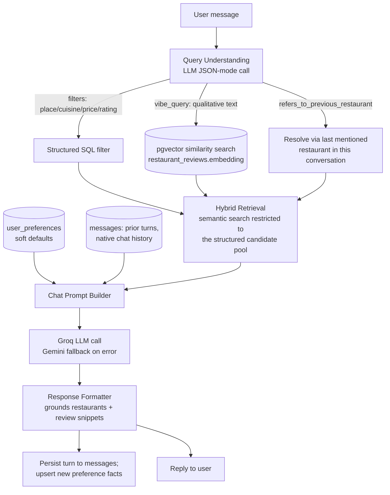

# Architecture — AI Restaurant Chat Assistant

## 1. Overview

A chat assistant that helps users find restaurants: users converse naturally
("suggest a quiet vegetarian place under ₹1000"), and the assistant grounds
its answers in both structured restaurant facts and real customer review
text, remembering stated preferences (e.g. "I'm vegetarian") across
conversations.

**Data source:** [ManikaSaini/zomato-restaurant-recommendation](https://huggingface.co/datasets/ManikaSaini/zomato-restaurant-recommendation) (Hugging Face) — ~9,200 restaurants, ~226k customer reviews.

**Core design principle — hybrid retrieve-then-generate (RAG-style):**
The LLM is never given the raw dataset or asked to "know" restaurants from
memory. Structured facts (place, cuisine, price, rating) stay structured —
exact/cheap SQL filtering. Only the qualitative part of a query ("quiet",
"good for a date") goes through embeddings — pgvector semantic search over
review text, restricted to the structured candidate pool when both are
present, so "quiet date spot in Koramangala under ₹800" never returns a
quiet place outside Koramangala just because its reviews scored well
semantically. The LLM only ranks, explains, and phrases the reply from that
grounded shortlist plus real review excerpts — never allowed to invent a
restaurant or a claim not backed by the data it was given.



---

## 2. Backend package layout

The backend is an installable Python package (`backend/pyproject.toml`,
`pip install -e .`) organized by domain under `app/` — no `sys.path`
manipulation anywhere; every cross-module import is a normal
`from app.<domain>.<module> import ...`.

```
backend/
  app/                     installable package
    settings.py            loads backend/.env once, on first import of `app`
    logging_config.py      configures the "app" logger tree -> console + backend/dump.log
    data/                  acquisition.py, cleaning.py (one-off dataset prep scripts)
    storage/               db.py (pooled connection), schema.py, load.py
    auth/                  tokens.py (JWT/bcrypt), users.py, password_reset.py, email.py, schema.py
    llm/                   groq_client.py (primary), gemini_client.py (fallback)
    reviews/                schema.py, ingest.py, embed.py, embedding_model.py
    conversation/           store.py (conversations/messages), preferences.py (durable facts), schema.py
    retrieval/               known_values.py, hybrid.py, cache.py
    query_understanding/     understanding.py
    chat/                     prompt_builder.py, response_formatter.py, service.py
    api/                      main.py (FastAPI app + routes)
  data/                    raw/processed datasets (gitignored CSVs; not shipped in the package)
  evaluation/              scenario-based grounding/relevance evaluation (see EVALUATION.md)
```

Each domain package carries its own colocated `tests/`. Databases schemas
(`schema.sql`) live next to the module that owns that table.

---

## 3. Components

| Component | Package | Responsibility |
|---|---|---|
| Data prep | `app/data` | One-off scripts: fetch the raw HF dataset, clean/normalize/dedup it into `restaurants_clean.csv` |
| Storage | `app/storage` | PostgreSQL connection pool (`ThreadedConnectionPool`) + `restaurants` schema/load |
| Auth | `app/auth` | Registration/login, bcrypt password hashing, JWT issue/verify, password reset tokens, transactional email (Resend) |
| LLM | `app/llm` | Groq client (primary) with automatic Gemini fallback on error; shared by query understanding and chat generation |
| Review Ingestion | `app/reviews` | Re-derives individual reviews from the raw dataset, embeds them locally (`sentence-transformers`, 384-dim), stores in pgvector |
| Conversation Store | `app/conversation` | `conversations`/`messages` (multi-turn memory) and `user_preferences` (durable, cross-session soft-default facts) |
| Retrieval | `app/retrieval` | Known place/cuisine values (for snapping free text to canonical DB casing); hybrid structured-SQL + pgvector semantic retrieval, with an in-process TTL cache in front of it |
| Query Understanding | `app/query_understanding` | One LLM JSON-mode call per message: intent, hard filters, vibe query, reference resolution, durable preference extraction |
| Chat | `app/chat` | Multi-turn prompt construction, review-grounded response formatting, and the service layer orchestrating one full chat turn |
| API | `app/api` | FastAPI app: auth routes + chat routes (including SSE token streaming), behind a JWT dependency |
| Evaluation | `evaluation/` | Scenario-based grounding/relevance checks against the live retrieval + generation pipeline |
| Frontend | `frontend/` | React app — chat is the sole post-login screen; login/register/forgot/reset-password flows |

---

## 4. Key design decisions

- **Hybrid retrieval, not pure RAG-over-everything.** Structured constraints
  (place/cuisine/price/rating) are always exact SQL; only the qualitative
  remainder of a query goes through embeddings, and semantic search is
  restricted to the structured candidate pool when both are present. Cheaper
  and keeps hard constraints exact, at the cost of needing a query
  understanding step to separate the two.
- **Query understanding is a separate LLM call from generation.** One call
  extracts structure from *one message*; a second call writes a grounded
  reply from a *candidate shortlist*. Mixing them would mean re-parsing the
  model's own prose to figure out what it was asked — exactly the kind of
  hallucination surface the rest of the pipeline avoids.
- **JWT bearer auth, not server-side sessions.** The React SPA and FastAPI
  backend are separate processes talking over CORS; a signed, stateless
  token avoids needing shared session storage (Redis) at this scale. Token
  persisted client-side in `localStorage` — simple and sufficient here, but
  readable by JS (XSS risk); an httpOnly cookie would be more defensive if
  hardened for production traffic.
- **Preferences are soft defaults, not hard filters.** A stored fact like
  "vegetarian" is folded into the semantic (vibe) side of retrieval and
  shown to the LLM as a bias, not enforced as a SQL `WHERE` clause — a
  one-off request in the current message can still override it.
- **Groq primary, Gemini fallback.** If Groq errors (rate limit, outage,
  bad key), both the chat-generation call and the query-understanding call
  automatically retry against Gemini rather than failing the request
  outright.
- **A real installable package, not `sys.path.insert()`.** Every
  cross-module import is a normal package import. This isn't just cosmetic:
  a `sys.path`-hacked layout previously let the same retrieval/relax-on-empty
  logic get duplicated across two unrelated modules unnoticed, and separately
  contributed to a real connection-pool deadlock bug (a re-entrant `close()`
  call recursing into a non-reentrant lock) that only became avoidable once
  the codebase had one clear ownership structure per concern.
- **Real logging, not silent by default.** Every domain module logs via
  `logging.getLogger(__name__)`, configured once (`app/logging_config.py`)
  to write to both console and `backend/dump.log` (rotating, capped size) —
  auth attempts/outcomes, retrieval candidate counts and relaxation/fallback
  triggers, which LLM provider served a reply, and persisted chat turns are
  all traceable after the fact without attaching a debugger.

## 5. Open decisions / explicitly out of scope

- **Refresh-token rotation, email verification, rate-limiting on login,
  role-based admin access** — none are required by the current feature set;
  noted here so they're a deliberate omission, not an oversight.
- **Deployment/monitoring** — no packaging/deploy pipeline or production
  logging/metrics infrastructure exists yet beyond the local `dump.log`;
  not yet needed at this project's stage.
- **Statistical/large-scale LLM evaluation** (hundreds of scenarios, scored
  rubrics) — not warranted at this project's scale; see `evaluation/EVALUATION.md`
  for what's covered instead.
