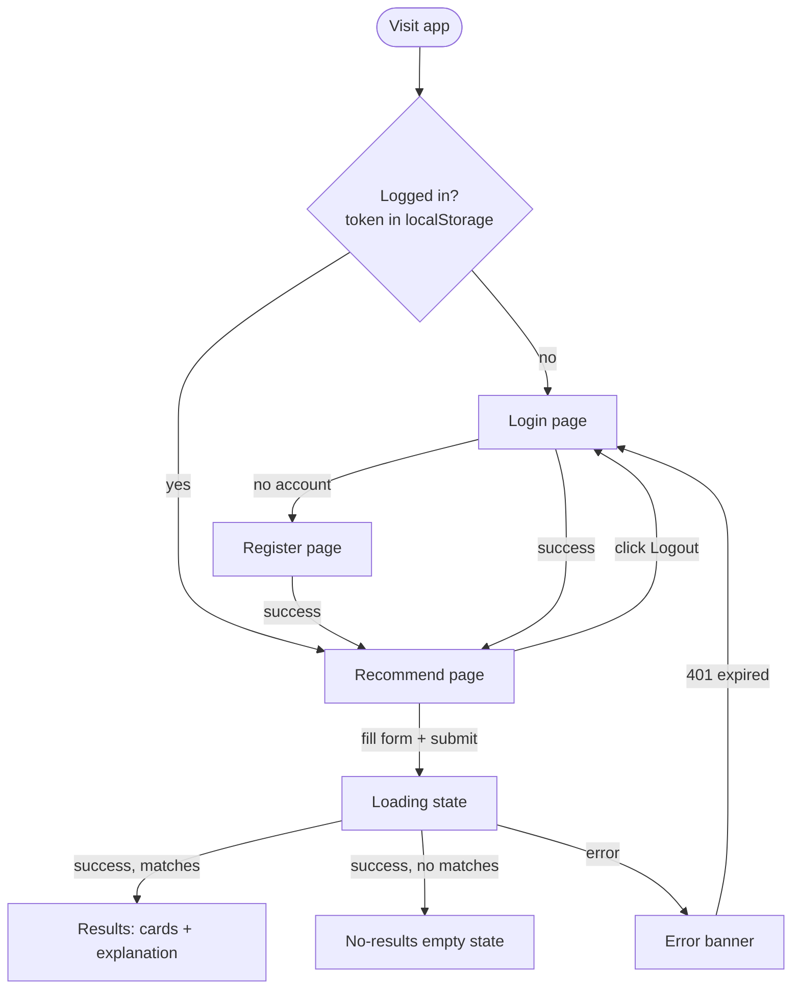

# Phase 11 — UI/UX Design & Frontend Development

Design process behind the rebuilt frontend, done before/alongside implementation.

## 1. User flows



Every screen has one obvious next action: log in or register on entry, fill the form once inside, and either read results, adjust and retry on empty/error, or log back in on session expiry.

## 2. Wireframes (low-fidelity)

**Login / Register**
```
┌──────────────────────────────┐
│           Navbar              │
├──────────────────────────────┤
│                                │
│        [ App name ]           │
│     Sign in to continue       │
│                                │
│   Email    [______________]   │
│   Password [______________]   │
│                                │
│         [ Log in ]            │
│   Don't have an account?      │
│         Register              │
│                                │
└──────────────────────────────┘
```

**Recommend page (protected)**
```
┌──────────────────────────────────────┐
│  Navbar: App name      Hi, Tanya | Logout │
├──────────────────────────────────────┤
│  Find a restaurant                    │
│  Place [▾]  Cuisine [▾]               │
│  Max price [___]  Min rating [___]    │
│              [ Get recommendation ]   │
├──────────────────────────────────────┤
│  (loading spinner)                    │
│    -- or --                           │
│  [card] [card] [card]   <- responsive │
│  grid, wraps on narrow screens        │
│  Explanation paragraph                │
│    -- or --                           │
│  Empty state / Error banner           │
└──────────────────────────────────────┘
```

## 3. Component inventory

Shared, reused across pages rather than one-off per screen:

| Component | Purpose |
|---|---|
| `Navbar` | Branding + auth-aware nav (Login/Register vs. user name + Logout) |
| `Button` | Primary/secondary/danger variants, disabled + loading sub-state |
| `TextField` | Labelled text/password/number input, shows validation error inline |
| `SelectField` | Labelled select, same label/error pattern as TextField |
| `Card` | Generic bordered surface (used by RestaurantCard, auth forms) |
| `RestaurantCard` | One restaurant's facts (name, place, cuisines, price, rating, votes) |
| `Spinner` | Loading indicator, used inline in buttons and page-level loading |
| `Alert` | Error/info banner, one consistent visual pattern app-wide |
| `EmptyState` | Friendly "nothing here yet" / "no matches" screen |
| `ProtectedRoute` | Redirects to `/login` if not authenticated |

## 4. Design tokens

Extends the existing light/dark tokens in `index.css` (`--text`, `--bg`, `--border`, `--accent`, etc.) with:
- `--space-1` … `--space-6` — consistent spacing scale instead of ad hoc pixel values
- `--radius-sm` / `--radius-md` — consistent corner rounding
- `--success` / `--error` — status colors for Alert variants, distinct from `--accent`

## 5. States covered

- **Loading** — spinner in the submit button + disabled form while waiting (the LLM call can take a few seconds)
- **Empty (before search)** — friendly prompt, not a blank page
- **Empty (no matches)** — distinct message, suggests widening budget/rating
- **Error** — one Alert pattern for validation, unknown place/cuisine, network failure, and expired/invalid session (redirects to login)
- **Success** — restaurant cards + explanation

## 6. Navigation & accessibility

- Persistent `Navbar` on every page (branding + auth state), not just an isolated form
- Semantic HTML throughout (`<nav>`, `<main>`, `<form>`, `<label htmlFor>`)
- Every interactive element is a native `button`/`input`/`select`/`a` — keyboard-operable by default, visible `:focus-visible` outlines
- Form fields always paired with a visible `<label>`; errors announced via `role="alert"` on the Alert component
- Color tokens carry through both light and dark themes with adequate contrast (inherited from the existing token system)

## 7. Responsive layout

- Form fields stack to a single column under 560px (already established breakpoint)
- Restaurant results use `grid-template-columns: repeat(auto-fill, minmax(...))` so the card grid reflows naturally from 1 to N columns rather than a fixed layout
- Navbar collapses spacing on narrow viewports; no horizontal scroll at any width
